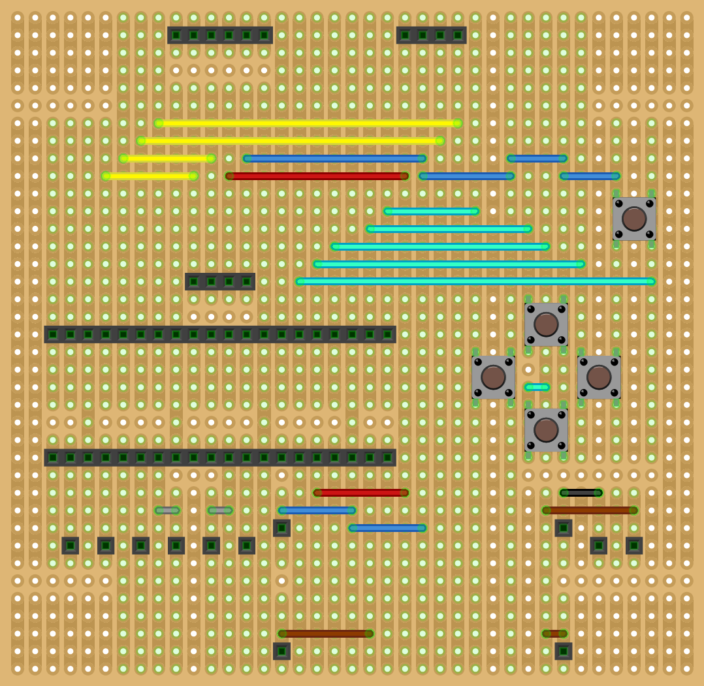

# Raspberry Pi Pico-powered door control

Prototype hardware used to control two relays via the L298N motor driver.

## Features

- Open and close the door on schedule or manually
- Change the opening/closing duration, speed (for actual DC motors - not implemented), repeat count and rate
- Store system time and settings between reboots
- Support multiple menu languages (change in `controller/config.py`)

Requires [CircuitPython 7.3.3](https://github.com/adafruit/circuitpython/releases/tag/7.3.3).
Successfully tested with CircuitPython 8.0.0 but downgraded due to stability issues.

## Bill of materials

- Raspberry Pi Pico
- DC motor or relays
- L298N motor driver
- SH1106 OLED display
- DS3231 RTC module
- Tactile switches (x5)
- Stripboard and jumper wires
- Terminal blocks and male/female headers

## Setting up

1. Install CircuitPython
2. Install dev dependencies: `pip install -r requirements-dev.txt`
3. Install board dependencies: `circup install -r requirements.txt`
4. Copy application code: `bash update.sh`

## Prototype design

